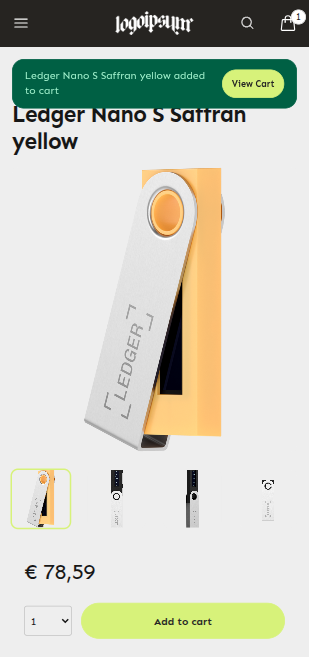

# Vendure Astro SSR + DaisyUI starter template

Why another starter? This one is meant to quickly set up a storefront for Vendure, theme it with a single CSS file, and build on top of it. It really is a starter with only the essentials: You start here, theme it, then extend and modify it to fit your project.



Of course, in the age of AI, we've included instructions for your AI agents to implement new features fast: See the `Customizing - AI is your friend` section for more information.

**Philosophy**: Simple but complete starting point. Minimal external dependencies. Themable: easy to change the look and feel. You can copy/paste the css generated by [DaisyUI's theme generator](https://daisyui.com/theme-generator/) into `src/styles/global.css`.

## Stack

- Astro (SSR) + React
- TailwindCSS + DaisyUI for easy themability
- GraphQL Tada

## Features

- Payments via Mollie (requires Mollie Plugin in Vendure)
- Multi-language
- Storefront page
- Product Detail pages
- Product Listing pages
- Checkout
- Stale while revalidate caching (SWR)
- Sitemap.xml
- Stale-while-revalidate caching.

**Is a cache really part of the bare minimum?** Vendure can be delayed by a few MS at peak traffic times, this is OK for add to cart and stuff, **but it should never affect page loading times!**. That is why we feel the stale-while-revalidate caching is part of the minimum

## Getting Started

- Create a `.env` file in the root with the following variables:
```bash
PUBLIC_VENDURE_SHOP_API=https://your-vendure.io/shop-api
CACHE_INVALIDATION_SECRET=some-secret-for-cache-invalidation-webhook
PUBLIC_DEFAULT_LOCALE=en
PUBLIC_ENABLED_LOCALES=en
```
- Set your schema URL in `tsconfig.json` for GraphQL Tada types.
- Add labels for your enabled locales in `translations.ts`
- Run `npm run dev` to start the development server

## Customizing - AI is your friend

We have included a set of guidelines in AGENTS.md that can help you with the development of your project. Based on [Thinking in React](https://react.dev/learn/thinking-in-react), we work in the following manner:

1. Start with a static mock up. Use this prompt for example: `You are the "@ui-developer-agent.md". Add review stars to the ProductDetailPage, and list reviews at the bottom of the page`.
2. Implement real data, interactivity and state: `You are the "@typescript-developer-agent.md". Fetch reviews from Vendure via GraphQL and map to the reviews UI in the ProductDetailPage. Calculate the average rating based on all reviews and use the value to display the amount of stars.`.

## Cache invalidation

To invalidate all SSR cache entries, call the `/api/invalidate-cache` endpoint with your `CACHE_INVALIDATION_SECRET` as a Bearer token.

```bash
curl -X GET "http://localhost:4321/api/invalidate-cache" -H "Authorization: Bearer test-secret456"
```

To invalidate by tags, pass a comma-separated list of tags via the `tags` query parameter.

```bash
curl -X GET "http://localhost:4321/api/invalidate-cache?tags=home,product,product:slug-1" -H "Authorization: Bearer test-secret456"
```

Available tags:

- `home` — home page
- `collection` — all collection pages
- `collection:<slug>` — a specific collection page
- `product` — all product pages
- `product:<slug>` — a specific product page
